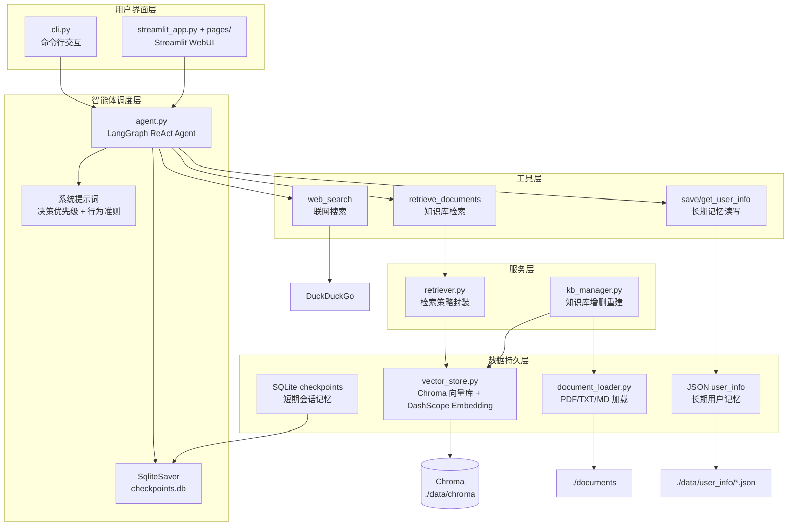

## 1. 项目实现：1 天全栈开发流程

本项目从架构设计到功能完整运行，全部在 **Day 3** 内完成。高效的核心并非手速，而是 **AI 工具链的精准分工**：把"业务逻辑设计"留给人类，把"代码实现与 Debug"交给 AI IDE。

### 1.1 三步工作流

```
┌─────────────────┐     ┌─────────────────┐     ┌─────────────────┐
│   主控窗口       │────▶│    AI IDE       │────▶│   开发者（我）   │
│ (DeepSeek 对话) │     │  (代码助手)      │     │  (审校与集成)   │
└─────────────────┘     └─────────────────┘     └─────────────────┘
```

**第一步：主控窗口负责架构设计**

开发者首先在对话窗口中完成系统级思考：模块怎么划分？数据如何流动？每个模块的输入输出是什么？随后，将思考结果转化为**结构化的编码 prompt**——不是模糊的"帮我写个知识库"，而是精确的"创建一个 vector_store.py，职责是文档分块与 Chroma 持久化，需要以下函数：create_vector_store、load_vector_store、add_documents……"

**第二步：AI IDE 全权负责编码与 Debug**

AI IDE 接收结构化 prompt 后，独立完成具体编码、依赖安装、运行测试和错误修复。所有编译错误、接口变动、依赖冲突都在 IDE 内部闭环解决，**绝不把报错信息贴回对话窗口污染上下文**。这正是"AI 驱动开发"的关键：让工具处理细节，让人脑保持对架构的清晰掌控。

**第三步：开发者审校、集成与微调**

开发者审查 AI IDE 产出的代码，确认其是否符合预设的数据流；将各模块集成为完整系统；最后调整前端交互（如 Streamlit 页面跳转、按钮布局）。整个过程中，开发者始终聚焦于**数据流向和业务逻辑**，而非某一行代码的语法细节。

### 1.2 方法论验证：框架会变，逻辑不变

Day 3 的开发过程验证了一个核心洞察：**LangChain 的 import 路径可能每月一变，但 RAG 的数据流（加载→分块→向量化→存储→检索→增强→生成）和 Agent 的 ReAct 循环（观察→思考→行动）是稳定的业务逻辑。**

当 AI IDE 发现 `langchain` 某接口已废弃时，它会自动查找替代方案并完成迁移；而开发者只需要确保"文档依然能被正确分块和检索"、"Agent 依然能根据用户问题选择合适工具"。这种分工，让一天内交付全栈应用成为可能。

---

## 2. 快速开始

### 2.1 环境要求

- Python >= 3.13
- 依赖管理工具：[uv](https://github.com/astral-sh/uv)

### 2.2 核心依赖

主要依赖已在 `pyproject.toml` 中声明，包括：

| 依赖 | 用途 |
|------|------|
| `langchain>=1.2.15` | LangChain 核心框架 |
| `langchain-chroma>=1.1.0` | Chroma 向量存储集成 |
| `langchain-deepseek>=1.0.1` | DeepSeek LLM 接入 |
| `langgraph>=1.1.9` | ReAct Agent 图编排 |
| `langgraph-checkpoint-sqlite>=2.0.0` | 会话状态 SQLite 持久化 |
| `chromadb>=1.5.8` | 本地向量数据库 |
| `dashscope>=1.25.17` | 灵积平台 Embedding 服务 |
| `pypdf>=6.10.2` | PDF 文档解析 |
| `streamlit` | WebUI 框架 |
| `duckduckgo-search>=8.1.1` | 联网搜索 |

### 2.3 安装与启动

```bash
# 1. 克隆项目
git clone <repository-url>
cd 3-Day-Agent

# 2. 安装依赖
uv sync

# 3. 配置环境变量
# 复制 .env 模板并填入你的 API Key
cp .env.example .env
```

`.env` 文件模板：

```ini
DEEPSEEK_API_KEY=your-deepseek-api-key
DEEPSEEK_BASE_URL=https://api.deepseek.com/v1
DASHSCOPE_API_KEY=your-dashscope-api-key
```

```bash
# 4. 将需要检索的文档放入 ./documents 目录
# 支持格式：PDF、TXT、Markdown

# 5. 启动应用

# 方式一：WebUI（推荐）
python start.py
# 或直接使用 streamlit
streamlit run streamlit_app.py

# 方式二：CLI
python cli.py
```

首次启动时，系统会自动尝试加载已持久化的向量库。若向量库不存在，可通过 CLI 的 `/kb rebuild` 命令或 WebUI 的"重建知识库"功能，从 `./documents` 目录构建初始索引。

---

## 3. 使用说明

### 3.1 CLI 使用方式

启动 CLI 后，先使用 `/login <用户名>` 登录，随后即可进行多轮对话。

**常用命令：**

| 命令 | 说明 |
|------|------|
| `/login <用户名>` | 登录或切换用户，自动创建新会话 |
| `/new` | 开启一个新会话 |
| `/switch <会话ID>` | 切换到已有会话 |
| `/history` | 查看当前会话的历史消息 |
| `/userinfo` | 查看当前用户的长期记忆 |
| `/kb add <文件路径>` | 添加文件到知识库 |
| `/kb delete <文件路径>` | 从知识库删除文件 |
| `/kb rebuild` | 重建知识库（会确认） |
| `/kb search <关键词>` | 在知识库中搜索 |
| `/help` | 显示帮助 |
| `/quit` | 退出 |

CLI 支持**流式输出**：Agent 思考过程和最终回复会实时逐字显示。

### 3.2 WebUI 使用方式（Streamlit）

WebUI 采用 Streamlit 多页面架构，入口为 `streamlit_app.py`。

**使用流程：**

1. **登录页**：输入用户名，系统自动加载向量库、构建检索器、创建 Agent，并生成唯一会话 ID。
2. **聊天页**：主对话界面，支持流式回复。侧边栏可快速切换：
   - 新对话：创建全新会话
   - 知识库：进入知识库管理页
   - 长期记忆：查看和编辑用户记忆
   - 历史对话：浏览并恢复过往会话
3. **知识库页**：文件列表查看、文档搜索、上传新文档、重建知识库。
4. **长期记忆页**：以键值对形式查看和编辑 Agent 记住的个人信息。
5. **历史对话页**：会话列表，支持点击进入或删除。

### 3.3 交互示例

**示例 1：询问知识库内容**

```
用户：请解释一下 PSR 的详细证明过程
助手：（调用 retrieve_documents）
    [1] 来源: ./documents/PSR详细理论证明.md
    假设策略参数为 θ，平滑后的策略为 ...
    
根据知识库中的《PSR详细理论证明》，PSR 的核心思路是...
```

**示例 2：保存和查询个人信息**

```
用户：我叫 Alice，是一名强化学习研究员
助手：已保存信息: 姓名 = Alice

用户：我的研究方向是什么？
助手：（调用 get_user_info）
    你的研究方向是强化学习。
```

**示例 3：联网搜索实时信息**

```
用户：今天上海天气怎么样？
助手：（调用 web_search）
    根据搜索结果（来源: weather.example.com），
    上海今天多云，气温 22-28°C...
```

---

## 4. 模块设计与业务逻辑

本章按数据流自下而上讲解各模块。阅读时建议抓住两个问题：**这个模块解决了什么业务问题？数据如何流入和流出？**

---

### 4.1 `vector_store.py` —— 文档分块、向量化与 Chroma 持久化

**业务职责**：将原始文档转换为可语义检索的向量表示，并持久化到本地 Chroma 数据库。

**核心业务逻辑**：

```
原始文档 (List[Document])
    │
    ▼
RecursiveCharacterTextSplitter（中文友好分隔符）
    │
    ▼
文档块 (List[Document])
    │
    ▼
DashScopeEmbeddings(text-embedding-v4)
    │
    ▼
Chroma.from_documents() ──▶ 持久化到 ./data/chroma
```

**关键设计决策**：

- **中文友好的分块策略**：`RecursiveCharacterTextSplitter` 的分隔符序列按 `\n\n` → `\n` → `。` → `！` → `？` → `；` → ` ` → `""` 优先级递归切分。这保证中文段落优先在句末断点分割，避免把一个完整的语义句子拦腰截断。
- **chunk_size=1000, chunk_overlap=200**：在信息密度和检索粒度之间取平衡。1000 字符足以容纳一个完整的论证段落；200 字符重叠确保跨块边界的关键信息不会丢失。
- **DashScope `text-embedding-v4`**：选用灵积平台的 Embedding 模型，对中文语义理解效果稳定，且 API 调用成本可控。
- **增量添加与删除**：`add_documents` 和 `delete_documents` 支持在已有向量库上增删，无需每次都全量重建。

**对外接口**：

| 函数 | 作用 |
|------|------|
| `create_vector_store(docs)` | 从原始文档创建并持久化新的向量库 |
| `load_vector_store(persist_dir)` | 加载已持久化的向量库 |
| `add_documents(vectordb, docs)` | 向现有向量库增量添加文档 |
| `delete_documents(vectordb, ids/filter)` | 按 ID 或元数据过滤条件删除文档 |
| `get_collection_stats(vectordb)` | 获取集合名称、文档数量等统计信息 |

---

### 4.2 `retriever.py` —— 检索策略封装与对外暴露

**业务职责**：从向量库中检索与查询语义最相关的文档片段，并以标准 `BaseRetriever` 形式供上层链式调用。

**核心业务逻辑**：

```
用户查询字符串
    │
    ├──▶ similarity_search ──▶ 按余弦相似度返回 Top-K
    │
    ├──▶ mmr_search ──▶ 最大边际相关性搜索（平衡相关性与多样性）
    │
    └──▶ similarity_search_with_threshold ──▶ 带相似度阈值过滤，剔除低质量结果
```

**关键设计决策**：

- **提供两种使用形态**：
  - `build_retriever()` 工厂函数：直接返回 LangChain 标准的 `BaseRetriever`，可无缝接入 LCEL 链或 Agent 工具。
  - `RetrievalEngine` 类：面向需要精细控制检索参数的场景（如调整 MMR 的 `lambda_mult`、设置 `score_threshold`、添加元数据过滤等）。
- **阈值过滤的 score 转换**：Chroma 返回的是 L2 距离（越小越相似），代码中通过 `1 / (1 + distance)` 转换为近似的相似度分数（0~1），便于设置直观阈值。
- **默认 search_kwargs={"k": 4}**：在召回充分性和上下文窗口长度之间取折中，Agent 每次检索不会带入过多冗余信息。

**对外接口**：

| 函数/类 | 作用 |
|---------|------|
| `build_retriever(persist_dir, search_type, search_kwargs)` | 工厂函数，返回配置好的 `BaseRetriever` |
| `RetrievalEngine.similarity_search(query, k, filter)` | 相似度搜索 |
| `RetrievalEngine.mmr_search(query, k, fetch_k, lambda_mult)` | MMR 多样性搜索 |
| `RetrievalEngine.similarity_search_with_threshold(query, score_threshold)` | 带阈值过滤的搜索 |
| `RetrievalEngine.get_retriever()` | 从引擎实例获取标准 `BaseRetriever` |

---

### 4.3 `kb_manager.py` —— 知识库的增删重建管理

**业务职责**：以**文件**为粒度管理知识库内容，支持单文件增删、全库重建和知识库内搜索。

**核心业务逻辑**：

```
文件路径
    │
    ├──▶ _load_single_file ──▶ PyPDFLoader / TextLoader ──▶ List[Document]
    │                                                                │
    │                                                                ▼
    │                                                    add_documents(vectordb, docs)
    │                                                                │
    └──▶ delete_file_from_kb ──▶ 按 source 元数据过滤 ──▶ vectordb.delete(ids)

全量重建：
docs_directory ──▶ load_documents() ──▶ create_vector_store() ──▶ 新的持久化向量库
```

**关键设计决策**：

- **文件级元数据追踪**：每个文档块都携带 `source`（原始文件路径）和 `file_type`（pdf/txt/markdown）元数据。这让"删除某个文件的所有内容"成为可能——只需按 `source` 过滤后批量删除对应 IDs。
- **重建时的 Windows 兼容处理**：`rebuild_kb` 在删除旧向量库目录前执行 `gc.collect()`，并带 5 次重试机制，避免 Windows 下文件句柄未释放导致的 `PermissionError`。
- **加载与向量化的解耦**：`kb_manager` 只负责"文件→Document"的加载和"对 vectordb 的操作"，实际的向量化与持久化仍然委托给 `vector_store.py`，保持职责清晰。

**对外接口**：

| 函数 | 作用 |
|------|------|
| `add_file_to_kb(vectordb, file_path)` | 将单个文件加载并加入向量库 |
| `delete_file_from_kb(vectordb, file_path)` | 按 source 删除某文件的所有块 |
| `rebuild_kb(persist_dir, docs_directory)` | 清空并重建整个知识库 |
| `search_kb(vectordb, query, k)` | 在知识库中搜索并返回格式化结果 |

---

### 4.4 `tools.py` —— Agent 可调用的工具定义

**业务职责**：为 Agent 封装三个核心能力——**知识库检索**、**长期记忆读写**、**联网实时搜索**——并以 LangChain `BaseTool` 列表形式暴露。

**核心业务逻辑**：

```
create_tools(user_id, retriever, enable_web_search)
    │
    ├──▶ retrieve_documents(query) ──▶ retriever.invoke(query) ──▶ 格式化文档片段+来源
    │
    ├──▶ save_user_info(key, value) ──▶ memory_manager.save_user_info(user_id, key, value)
    │
    ├──▶ get_user_info(key) ──▶ memory_manager.get_user_info(user_id, key)
    │
    └──▶ web_search(query) ──▶ DuckDuckGoSearchResults ──▶ 联网搜索结果（可选）
```

**关键设计决策**：

- **工具即函数的简洁设计**：使用 `@tool` 装饰器将普通函数直接转为 Agent 可调用的 `BaseTool`，无需继承复杂类。工具 docstring 即为 Agent 的"使用说明书"——Agent 根据 docstring 描述自主决定何时调用哪个工具。
- **user_id 在工具创建时绑定**：`create_tools` 是工厂函数，在创建时就把 `user_id` 注入到 `save_user_info` 和 `get_user_info` 的闭包中。这保证多用户场景下，Agent 始终操作当前登录用户的记忆，而不会串号。
- **联网搜索为可选项**：通过 `enable_web_search` 参数控制，方便在无网络环境或不需要实时信息的场景下关闭。
- **检索结果截断与格式化**：`retrieve_documents` 将每段内容截断至 300 字符并标注来源，防止超长文档块撑爆 LLM 上下文窗口，同时让来源可追溯。

**对外接口**：

| 函数 | 作用 |
|------|------|
| `create_tools(user_id, retriever, enable_web_search)` | 工厂函数，返回 Agent 可用的工具列表 |

---

### 4.5 `memory_manager.py` —— 短期会话记忆 + 长期用户记忆

**业务职责**：管理两层记忆：
- **短期记忆**：当前会话的多轮对话历史，支持跨重启的连续对话。
- **长期记忆**：每个用户的持久化键值对信息（姓名、偏好等）。

**核心业务逻辑**：

```
短期记忆（会话级）：
session_id ──▶ FileChatMessageHistory(f"./data/chat_history/{session_id}.json")
    │                    │
    │                    └── 由 LangGraph SqliteSaver 实际主导持久化
    │                        （FileChatMessageHistory 保留以兼容历史接口）
    │
长期记忆（用户级）：
user_id ──▶ ./data/user_info/{user_id}.json
    │
    ├──▶ save_user_info(user_id, key, value) ──▶ 读取 → 更新 → 写回 JSON
    │
    └──▶ get_user_info(user_id, key) ──▶ 读取 JSON → 返回 value
```

**关键设计决策**：

- **短期记忆由 LangGraph SqliteSaver 接管**：代码中保留了 `get_session_history` 返回 `FileChatMessageHistory` 的接口以兼容旧模式，但实际 Agent 运行时的会话状态持久化由 `agent.py` 中的 `SqliteSaver`（写入 `./data/checkpoints.db`）负责。SQLite 方案比 JSON 文件更适合高频读写和事务性操作。
- **长期记忆使用简单 JSON 文件**：用户个人信息通常是低频读写、结构简单的键值对，JSON 足够轻量且便于人工查看和备份。
- **用户隔离**：每个用户拥有独立的 JSON 文件，天然隔离，无需复杂权限控制。

**对外接口**：

| 函数 | 作用 |
|------|------|
| `get_session_history(session_id)` | 获取指定会话的历史管理器 |
| `save_user_info(user_id, key, value)` | 保存用户的长期记忆 |
| `get_user_info(user_id, key)` | 查询用户的长期记忆 |

---

### 4.6 `agent.py` —— LangGraph ReAct Agent 创建与配置

**业务职责**：将所有组件（LLM、工具、系统提示词、记忆持久化）装配成一个可运行的 ReAct Agent。

**核心业务逻辑**：

```
系统提示词（角色定义 + 行为准则 + 联网规则）
    │
    ▼
langchain.agents.create_agent(
    llm_model="deepseek-chat",
    tools=tools,
    system_prompt=system_prompt,
    checkpointer=SqliteSaver(./data/checkpoints.db)
)
    │
    ▼
CompiledStateGraph（配置 recursion_limit）
```

**关键设计决策**：

- **LangGraph ReAct Agent**：使用 `create_agent`（LangChain 1.2.15 中 LangGraph 的 ReAct 封装）而非旧版 `AgentExecutor`。ReAct 循环让 LLM 自主决定"是否需要调用工具→调用什么工具→观察结果→继续思考或回复用户"，比固定流程更灵活。
- **系统提示词内置决策优先级**：
  1. 询问个人信息 → 先查 `get_user_info`
  2. 询问知识点/参考资料 → 先调用 `retrieve_documents`
  3. 涉及实时动态 → 调用 `web_search`
  4. 绝不编造，知识库无结果时诚实告知
- **SqliteSaver 持久化会话状态**：通过 SQLite 数据库存储 LangGraph 的 checkpoint，实现跨进程、跨重启的会话恢复。`thread_id` 对应 session_id，保证会话隔离。
- **`recursion_limit` 防护**：将 `max_iterations` 映射为 LangGraph 的 `recursion_limit`（×10 留有余量），防止 Agent 在极端情况下无限循环。

**对外接口**：

| 函数 | 作用 |
|------|------|
| `create_agent(tools, get_session_history, llm_model, temperature, max_iterations)` | 创建并返回配置好的 CompiledStateGraph Agent |

**调用方式**：

```python
agent.invoke(
    {"messages": [{"role": "user", "content": "..."}]},
    {"configurable": {"thread_id": "session_id"}}
)
```

---

### 4.7 `streamlit_app.py` —— WebUI 入口与模块装配

**业务职责**：Streamlit 多页面应用的入口页面，负责用户登录、全局状态初始化、以及各后端模块的**装配**。

**核心业务逻辑**：

```
用户输入用户名 ──▶ 登录按钮
    │
    ├──▶ load_vector_store() ──▶ 加载 Chroma 向量库
    │
    ├──▶ build_retriever() ──▶ 构建检索器
    │
    ├──▶ create_tools(user_id, retriever) ──▶ 创建工具集
    │
    ├──▶ create_agent(tools) ──▶ 创建 Agent
    │
    ├──▶ 生成 session_id ──▶ 记录会话
    │
    └──▶ st.switch_page("pages/chat.py")
```

**关键设计决策**：

- **登录即装配**：所有核心对象（vectordb、retriever、tools、agent）在登录时一次性创建并注入 `st.session_state`。后续页面（chat、kb、memory、history）直接从 session_state 读取，避免重复初始化。
- **错误拦截与友好提示**：向量库加载失败、检索器构建失败、工具创建失败、Agent 创建失败——每一步都有 `try/except` 捕获，并通过 `st.error()` 向用户展示中文错误信息，而不是抛出堆栈。
- **隐藏默认侧边栏导航**：通过 CSS 隐藏 Streamlit 原生的多页面导航，改用自定义侧边栏按钮控制页面跳转，保持 UI 风格统一。
- **多页面状态共享**：`st.session_state` 充当跨页面的全局状态容器，user_id、session_id、agent 实例等在各页面间无缝传递。

**对外接口**：无直接对外函数，作为 Streamlit 应用入口运行。

---

## 5. 架构图

下图展示了系统的五层架构与各模块之间的数据依赖关系：



**数据流说明**：

1. **用户提问**（UI 层）→ Agent 接收消息，结合系统提示词决定行动策略。
2. **工具调用**（工具层）→ Agent 按需调用检索、记忆或搜索工具，获取外部信息。
3. **检索与存储**（服务层 + 数据持久层）→ 检索器从 Chroma 向量库召回相关文档；记忆读写操作对应 SQLite/JSON 文件。
4. **结果回传** → 工具输出返回给 Agent，Agent 整合后生成最终回复，通过流式输出返回给用户。
5. **状态持久化** → 整个对话状态由 SqliteSaver 写入 SQLite，实现跨会话恢复。

---


