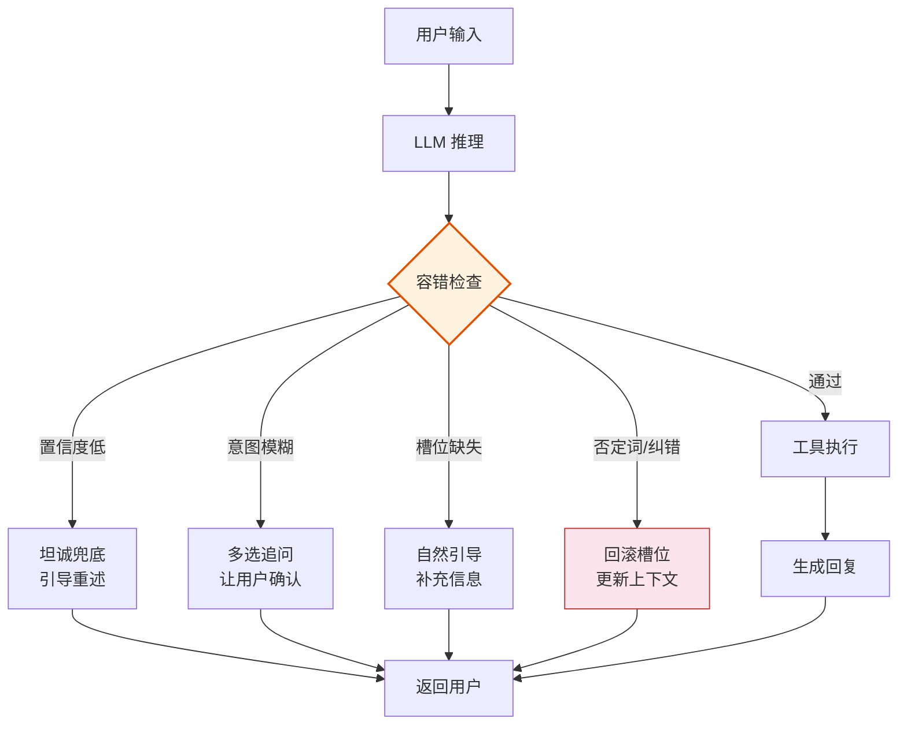

## LangGraph Agent 容错架构设计

### 核心思路

在 LangGraph 架构下，容错不是打补丁，而是**增加一个独立的 `error_handler` 节点**插入到 Agent 的图结构中。这个节点在每次 LLM 推理后执行，负责：

1. **检查输出质量**：解析置信度、意图模糊度
2. **决策**：放行 / 追问 / 补全槽位 / 兜底
3. **更新状态**：将纠错信息写回对话状态



### 三大设计原则

| 原则 | 说明 | 实现方式 |
|------|------|----------|
| **不侵入主逻辑** | Agent 的核心推理链不受影响 | 容错节点作为独立 state_node 插入 |
| **可降级兜底** | 容错本身也可能失败 | 最外层的 try-except 确保对话永不中断 |
| **状态可追溯** | 每次纠错被记录 | 写入 `state["error_log"]`，便于排查 |

###  Prompt

```
## 任务：为 LangGraph Agent 添加对话容错模块

### 背景
现有 Agent 使用 LangGraph 构建（agent.py），对话容错能力薄弱：
- 用户输入模糊时，Agent 容易胡乱猜测意图
- 用户纠正"不对"时，Agent 不会更新槽位
- 复杂查询缺少追问澄清机制
- 无法理解时容易硬回答，不能坦诚兜底

需要增加一个独立的容错模块，以 state_node 形式插入 Agent 图结构。

### 需求

#### 1. 新建 `error_handler.py` 模块
职责：对 LLM 的输出进行质量检查，决定放行还是触发容错策略。

实现一个函数 `create_error_handler_node(llm)`，返回一个 LangGraph state_node。

该节点内部包含以下子功能：

**a) 置信度检查**
- 解析 LLM 回复中的显式置信度标记（如 "[confidence:0.3]"）
- 若无标记，用启发式规则估算（回复过于简短/模糊则置信度低）
- 低于阈值时触发兜底，返回待发送给用户的澄清消息

**b) 意图消歧**
- 若 LLM 回复中同时出现多个可能的解释（如 "你可能想问 A 或 B"）
- 解析出多个意图选项，生成带有选项按钮/编号的追问文本
- 返回给用户供选择

**c) 槽位补全**
- 定义关键信息槽位（如：论文标题、作者、年份、术语定义等）
- 判断当前槽位是否缺失（用 LLM 快速判断或规则判断）
- 若缺失，生成自然追问："请问你指的是哪篇论文？能不能说一下大概的发表年份？"

**d) 上下文纠错**
- 检测负面信号词：不对、不是、错了、改成、应该是、换一个
- 若检测到，标记当前对话的最后一次理解可能需要回滚
- 生成确认："抱歉我理解错了，你是说...对吗？"

**e) 术语归一化**
- 调用已有的术语映射表，将口语/别称/简写转为标准术语
- 如 "SAM" → "Segment Anything Model"

**f) 最终兜底**
- 若以上策略均无法解决，生成坦诚回复：
  "抱歉，我暂时没能理解你的意思。你能换一种方式描述一下吗？比如告诉我你想查哪篇论文，或者想了解什么概念。"

#### 2. 修改 `agent.py`，集成容错节点
- 在现有的 LangGraph 图结构中，在 LLM 推理节点之后、工具执行节点之前，插入 error_handler 节点
- 如果 error_handler 判定需要追问/澄清/兜底，直接跳过工具执行，将追问消息返回给用户
- 如果通过，继续正常流程

#### 3. 状态扩展
在 LangGraph 的状态字典中增加以下字段（如不支持，可在外层维护）：
- `pending_clarification`: str | None  // 待发送的澄清消息
- `error_log`: list  // 记录每次纠错事件
- `last_slots`: dict  // 已确认的槽位信息
- `confidence`: float  // 最近一次 LLM 推理的置信度

#### 4. 修改 `app.py` 的流式输出逻辑
- 在流式输出循环中，检查 state 中是否有 `pending_clarification`
- 如果有，将其发送给用户（作为追问消息），并暂存当前对话状态等待用户响应

### 技术约束
- LangChain 1.2.15, LangGraph 配套版本
- 不引入新的重型依赖
- 保持现有接口兼容，不影响原有功能

### 验收标准
- 输入 "那个什么" → Agent 追问澄清而非胡乱回答
- 输入 "不对，我说的是2024年的那篇" → Agent 识别纠正意图，更新上下文
- 输入 "SAM" → Agent 自动扩展为 "Segment Anything Model"
- 任意输入都不会导致 Agent 崩溃或卡死
```

---

### 实施顺序建议

1. **先建 `error_handler.py`**：实现核心容错逻辑，用单元测试验证各策略
2. **再改 `agent.py`**：将容错节点插入图结构，测试完整链路
3. **最后调 `app.py`**：处理 Streamlit 的追问交互展示

