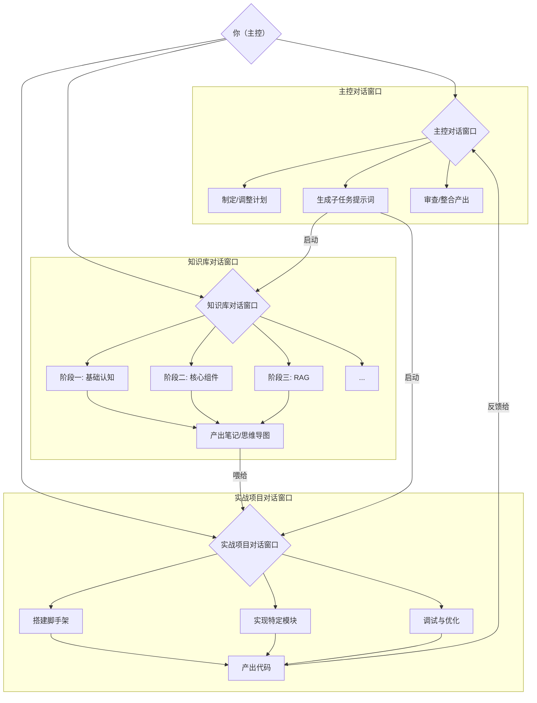

面对LangChain这种复杂度高、涉及面广的技术学习，单次对话确实难以完成系统化教学。我为你梳理了一套 **“主控调度 + 专题攻克 + 资产沉淀”** 的分布式学习方法，能有效解决你提到的上下文限制、系统化学习等难题。

### 🧭 总体思路

想象一下，把我当作你的一个知识库和思考引擎。这套方法的核心是：**你作为“主控大脑”，在多个独立但有明确分工的对话窗口中调度任务**。每个窗口完成一个独立模块的学习，并产出结构化的“知识资产”（代码、笔记、思维导图）。当需要新知识或进入下一阶段时，你只需在**新对话窗口**中提供上一阶段产出的“资产”作为最小化上下文，即可无缝衔接。

### 🗺️ LangChain 系统学习路线图

根据官方文档和主流学习路径，为你规划了以下7周的学习计划，从基础认知到多智能体实战，循序渐进。

| 学习阶段               | 核心主题                     | 学习目标                                                     |
| :--------------------- | :--------------------------- | :----------------------------------------------------------- |
| **基础认知与环境搭建** | LangChain 概览与环境配置     | 理解 LangChain 的价值，搭建 Python 开发环境，完成第一个程序。 |
| **核心组件深度掌握**   | Models, Prompts, Chains      | 掌握三大基础组件，能构建单步的 LLM 应用。                    |
| **检索增强生成 (RAG)** | RAG (Indexes, Retrievers)    | 构建“与你的数据对话”的问答系统，理解 Embedding 和向量数据库。 |
| **记忆与多轮对话**     | Memory 模块                  | 让应用具备“记忆力”，实现连贯的多轮对话交互。                 |
| **智能体 (Agent)**     | Agent, Tools, LangGraph      | 构建能自主规划、调用工具的智能体，理解 ReAct 思想。          |
| **高级主题与生态工具** | 回调, LCEL, LangSmith, 部署  | 掌握生产级应用所需的高级特性和调试、评估、部署工具。         |
| **综合实战项目**       | Multi-Agent 系统或企业级应用 | 综合运用所学，完成一个完整的、有挑战性的项目。               |

### 📋 多窗口协同工作流

我们将整个学习过程拆解为三类功能独立的对话窗口。这是一个高层次的架构，旨在让你清楚每种窗口的职责。



#### 窗口1: “主控调度室” (核心控制窗口)
此窗口是你学习过程中的总指挥部，用于制定全局计划、生成任务指令和管理产出资产。

*   **核心功能**:
    1.  **制定与调整计划**：以7周学习路线图为蓝图，在每个阶段开始前，在此窗口与我共同明确下一阶段的学习目标、关键知识点和交付成果。
    2.  **生成子任务提示词**：你在此窗口描述需求，我来为你**生成一个结构化的、可直接复制到新窗口使用的任务提示词**。这样即使你不懂LangChain，也能通过我的引导进行有效提问。
    3.  **审查与整合产出**：当一个专题窗口完成后，你可以将其产出的关键结论、代码片段或遇到的问题带回此窗口，我们共同复盘、整合或规划下一步。

*   **对话过长解决方案**: 此窗口天然关注宏观层面，信息密度高但增长慢。若仍触发限制，可要求我提供一份 **《主控状态摘要》** ，内容包含当前进度、下一步计划，在新的主控窗口中粘贴即可。

#### 窗口2: “知识专题研讨室” (理论学习窗口)
针对路线图中的每个阶段（如“核心组件”、“RAG”），开启一个独立的新对话窗口进行深度学习。

*   **核心功能**: 进行理论讲解、API用法演示、概念辨析和问题解答。
*   **启动方式**: 在主控窗口获取任务提示词后，**复制并开启一个新对话窗口**。示例提示词如下：
    > “你是一位LangChain专家讲师。我们当前的学习阶段是**阶段二：核心组件深度掌握**。请为我系统地讲解 LangChain 的三个核心组件：Models（模型交互）、Prompts（提示词模板）和 Chains（链式编排）。
    >
    > 要求：
    > 1.  每个组件讲解清楚其核心作用、常见用法和最佳实践。
    > 2.  提供可直接运行的Python代码示例。
    > 3.  最后请给出一个本章小结，并布置一个**小练习**（例如：用 LCEL (LangChain 表达式语言) 构建一个“根据菜名生成菜谱”的链）。
    > 4.  在对话结尾，请帮我生成一份**本阶段学习笔记摘要**，格式包括：核心概念、关键代码片段和踩坑记录。”

*   **知识资产沉淀**: 对话结束时，务必将讨论中的关键结论、代码示例、注意事项等整理成文档（如Markdown格式），保存到你的本地笔记中。
*   **对话过长解决方案**:
    1.  **主动分治**: 若感觉对话变长，主动要求我生成一份《当前进度总结》，然后在**新的知识专题窗口**中粘贴此总结，并附上“我们正在讨论[X]知识点，这是之前的进度总结：[粘贴总结]，请继续。”
    2.  **切换上下文模式**: 如果需要深入某个细节（如某个特定的Retriever），可以明确告诉我“请聚焦于此知识点进行深入讲解，暂时忽略其他内容”。

#### 窗口3: “代码实战训练营” (动手实践窗口)
理论学习后，开启独立的新窗口进行纯粹的代码编写、调试和优化。

*   **核心功能**: 专注于代码实现、测试、问题排查（Debug）和性能优化。
*   **启动方式**: 在主控窗口或完成某个理论专题后，开启新窗口。
    > “我现在要动手实现[项目名称]的[具体功能模块]。请你扮演一名资深Python开发伙伴，为我提供代码建议、审查代码逻辑和解决报错。
    >
    > 项目背景：[简要描述你的项目，如：一个简单的ReAct Agent，包含一个计算器和搜索引擎工具]。
    >
    > 具体问题：
    > 1.  我正在编写`initialize_agent`函数，但在选择`agent`参数时遇到困惑，`AgentType.ZERO_SHOT_REACT_DESCRIPTION`和`AgentType.CONVERSATIONAL_REACT_DESCRIPTION`有何区别？
    > 2.  这是我的部分代码 [粘贴代码]，请帮我检查是否有逻辑问题。”

*   **资产沉淀**: 将最终可运行的代码提交到你的Git仓库，并编写清晰的`README.md`说明项目目标、如何运行和核心逻辑。
*   **对话过长解决方案**: 如果项目复杂，可以为每个独立功能模块（如“工具定义”、“核心Agent逻辑”、“记忆模块”）分别开启一个实战窗口。

### 🛠️ 实用工具包：提示词与资产模板

#### 1. “主控调度室” 提问模板
在项目开始时，可直接使用此模板向我提问：
> “我们准备开始 **LangChain Agent 开发**的系统学习。请帮我规划一个为期7周的学习路径，并生成第一周‘基础认知与环境搭建’的详细任务清单和启动新窗口的提示词。”

#### 2. 知识资产模板
建议你为每个学习阶段创建的笔记文档（如`Week2_Core_Components_Summary.md`）遵循此结构，这将是跨窗口传递上下文的最佳载体：

```markdown
# 阶段X：[主题] 学习笔记

## 1. 核心概念与理解
- [用你自己的话总结该阶段的关键概念，例如：什么是Model I/O？]

## 2. 关键代码片段
```python
# 例如：一个标准的PromptTemplate使用示例
from langchain.prompts import PromptTemplate
# ... (你的代码)
```

## 3. 踩坑记录与解决方案
- **问题**：调用OpenAI API时遇到超时错误。
  - **原因**：网络波动或API Key设置问题。
  - **解决**：设置 `request_timeout` 参数并检查环境变量。
- **问题**：向量数据库检索结果不准确。
  - **解决**：调整了 `chunk_size` 和 `chunk_overlap` 参数。

## 4. 产出物清单
- [x] 思维导图一张
- [x] 可运行的`demo_chain.py`
- [x] 本阶段问答记录摘要
```

### 🤔 其他潜在问题与解决方案

1.  **版本兼容性带来的困扰**：LangChain 更新频繁。**解决方案**：在任何需要代码的新窗口中，都可在提示词中补充一句：“请基于LangChain最新稳定版（如 `langchain>=0.1.0`）提供代码示例。”

2.  **缺乏长期项目维护的上下文**：多窗口开发完项目后，如何整合？**解决方案**：使用**版本控制系统（如 Git）** 作为最终的“上下文聚合器”。每次在“代码实战训练营”完成一个功能模块并测试通过后，就提交一次代码。当需要回顾或整合时，直接查看代码库即可，无需依赖任何对话窗口。

3.  **API 密钥管理问题**：在不同窗口提供的代码示例中，API密钥的处理是一个安全隐患。**解决方案**：在你的提示词中加上一句：“**请使用`python-dotenv`从`.env`文件中加载API密钥等敏感信息，不要在代码中硬编码**。”

### 💎 总结

这套方法的精髓在于将复杂的、需要长上下文的学习任务，拆解为多个目标明确、可独立完成的小任务，并通过 **“结构化提示词”** 和 **“知识资产沉淀”** 实现跨对话的“软连接”。你作为主控者，负责调度和整合，我作为协作者，在每个独立窗口提供深度支持。现在，我们可以从“主控调度室”窗口开始，一起规划第一周的具体行动，你觉得如何？